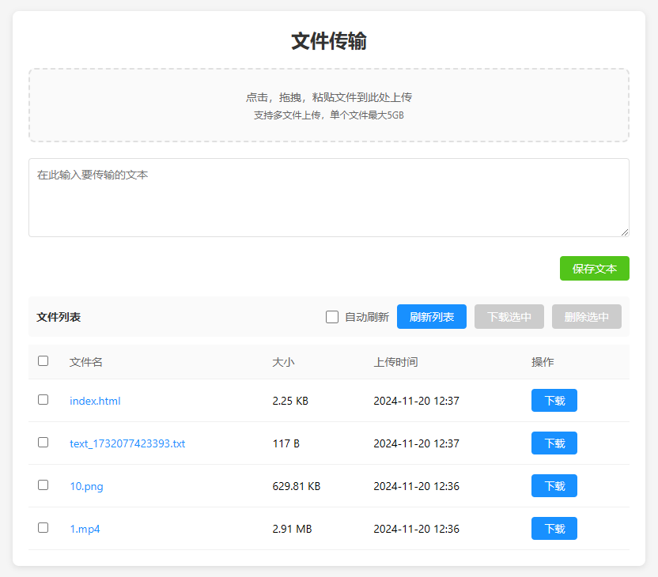

### Local network file transfer - clean, simple, with no privacy risks.

**Requires Node.js**

#### Install Dependencies

```console
npm install
```

#### Start Server

```console
npm run start

or
npm run s
```

#### Appearance




#### 创建快捷方式

目标命令(右键快捷方式->属性->目标)

```console
powershell.exe -NoProfile -ExecutionPolicy Bypass -File "D:\路径\start-app.ps1"
```
